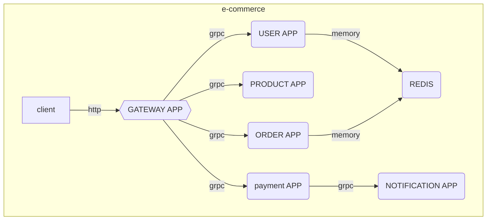
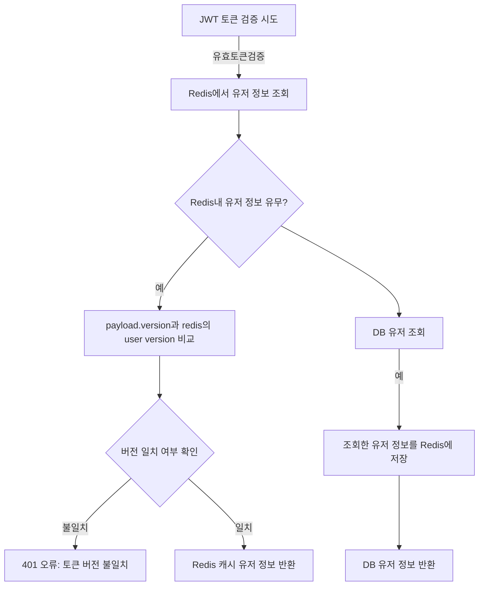

# 💻 NestJS MSA Project

마이크로서비스 기반 쇼핑몰 시스템으로, NestJS MSA와 gRPC를 사용해 구축되었습니다.
실무에서 요구되는 확장성, 장애 격리, 서비스 독립 배포가 가능한 구조를 직접 설계/구현한 경험을 보여주기 위해 제작되었으며,
분산 환경에서 확장 가능하고 모듈화된 아키텍처를 위해 설계된 시스템입니다.

---

### 📦 시작하기

> **api** : [http://localhost:3000](http://localhost:3000)

> **swagger** : [http://localhost:3000/api-docs](http://localhost:3000/api-docs)

```bash
## run
> docker compose up --build

## test
> npm run test:{app}
```

---

### 🛠 기술 스택

| 구분                 | 기술 스택                 |
| -------------------- | ------------------------- |
| **Architecture**     | NestJS MSA                |
| **Infra**            | AWS EC2, Docker           |
| **Database**         | MYSQL, Redis              |
| **Network**          | gRPC, protoc-gen-ts_proto |
| **Message platform** | RabbitMQ, Saga Pattern    |
| **Test**             | jest, K6                  |
| **Document**         | Swagger                   |

---

### 📍 서버구성



---

### 📚 Features

#### 🌟 재고 관리 (동시성 처리 및 부하테스트)

- **_제한된 재고 내에서 동시에 주문이 들어올 경우_**
- **Queue(RabbitMQ)로 메시지를 받아서 Redis RedLock 분산락으로 동시성 제어**
- **다중 인스턴스 환경에서도 처리 가능**
- k6로 부하 테스트 진행 (vus:1000 / duration:5초)

```ts
import Redlock, { Lock } from 'redlock';

async processInitiateOrder(dto, context: RmqContext){
    // rmq
    const channel = context.getChannelRef();
    const message = context.getMessage();

    // redis red lock
    const lockKey = `lock:order:${userId}`;
    const lockTtl = 10;
    const lock = await this.redisLockService.acquireLock(lockKey, lockTtl);

    ...
}
```

#### 🌟 JWT 관리 (유저 정보 변경 시 기존 토큰 만료)

- **_JWT를 사용으로 유저 정보를 변경해도 기존 발급된 토큰으로 잘못된 정보를 조회 가능._**
- **USER Version**을 추가하고 유저정보가 변경되면 redis내의 해당 유저의 version을 업데이트하여 기존 토큰과 비교 후 **사용 여부를 판단**할 수 있는 로직을 추가



### 🌟 authGuard

확장성을 고려하여 **CanActivate**를 이용

```js
@Injectable()
export class AuthGuard implements CanActivate {
    constructor(
        private readonly authService: GatewayAuthService,
        private readonly reflector: Reflector,
    ) {}
    ...
}

// decorator
export const Auth = Reflector.createDecorator<{
    isRefresh: boolean;
}>();

// controller
@Auth()
get(){}
```

### 🌟 rolesGuard

```js
// auth guard를 통과하고 파싱된 토큰에서 role을 추출
async canActivate(context: ExecutionContext): Promise<boolean> {
    const roles = this.reflector.get<AuthMicroService.UserRole[]>(Roles, context.getHandler());
    if (roles === undefined || roles.length === 0) return true;

    const request = context.switchToHttp().getRequest<Request>();
    const user = request.user;
    if (!user) return false;

    const userRole = user.role;
    if (roles.includes(userRole)) {
        return true;
    }

    throw new ForbiddenException('권한이 없습니다.');
}

// controller
@Roles([AuthMicroService.UserRole.ADMIN])
get(){}
```

### 🌟 GRPC PROTO

사용자 요청은 gateway 서버를 REST 요청을 하게 되며,
**MSA 간 통신은 gRPC를 사용**
*protoc-gen-ts_proto*로 Typescript로 컴파일 후 공통 인터페이스를 구현

> ./libs/repo/src/grpc

> ./proto

### 🌟 libs

각 서비스간 **공통 인터페이스를 위한 모노 레포지토리**
